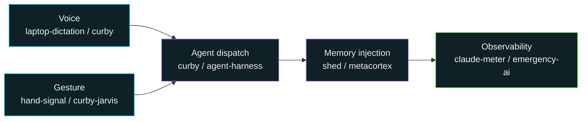

Building the layer that makes Claude Code learn you, hear you, and watch your hands — plus real systems work and a couple of creative builds.

→ **[casterlygit.github.io](https://casterlygit.github.io/)** — curated hub with live demos for every project

---

## How the stack fits together

---

## Agentic Claude-Code stack

**[shed](https://github.com/CasterlyGit/shed)** — Silent memory injection before every prompt: local ONNX embeddings, 6 ms warm, no LLM call, no network.
→ [demo](https://casterlygit.github.io/CasterlyGit/shed/) · [repo](https://github.com/CasterlyGit/shed)

**[metacortex](https://github.com/CasterlyGit/metacortex)** — The self-evolving layer above Claude Code: Constitution, Registry, Memory, and Shed working as one system.
→ [demo](https://casterlygit.github.io/CasterlyGit/metacortex/) · [repo](https://github.com/CasterlyGit/metacortex)

**[claude-meter](https://github.com/CasterlyGit/claude-meter)** — Always-on-top HUD showing your 5-hour and weekly token budgets as concentric rings, every visual property encoding real signal.
→ [demo](https://casterlygit.github.io/CasterlyGit/claude-meter/) · [repo](https://github.com/CasterlyGit/claude-meter)

**[agent-harness](https://github.com/CasterlyGit/agent-harness)** — Obsidian inbox ticket → live status page → Claude Code worker → merged PR, no keyboard in between.
→ [demo](https://casterlygit.github.io/CasterlyGit/agent-harness/) · [repo](https://github.com/CasterlyGit/agent-harness)

---

## Voice + Gesture HCI

**[curby-jarvis](https://github.com/CasterlyGit/curby-jarvis)** — Point at anything on screen, say what to do: a cost-ranked 7-connector AX chain resolves the action, 248 passing headless tests.
→ [demo](https://casterlygit.github.io/CasterlyGit/curby-jarvis/) · [repo](https://github.com/CasterlyGit/curby-jarvis)

**[curby](https://github.com/CasterlyGit/curby)** — Ctrl+Space → spoken Claude answer in ~1 s, or Ctrl+Shift+Space → autonomous sandboxed Claude Code agent. Mystical feather state indicator.
→ [demo](https://casterlygit.github.io/CasterlyGit/curby/) · [repo](https://github.com/CasterlyGit/curby)

**[laptop-dictation](https://github.com/CasterlyGit/laptop-dictation)** — Hold a hotkey, speak, release: local Whisper.cpp transcribes in ~250 ms and pastes into any focused app. No cloud, no API key.
→ [demo](https://casterlygit.github.io/CasterlyGit/laptop-dictation/) · [repo](https://github.com/CasterlyGit/laptop-dictation)

**[hand-signal](https://github.com/CasterlyGit/hand-signal)** — Six universal gestures give Claude Code a yes/no without touching the keyboard: 21-landmark MediaPipe classifier, ~5% CPU at 30 fps, all local.
→ [demo](https://casterlygit.github.io/CasterlyGit/hand-signal/) · [repo](https://github.com/CasterlyGit/hand-signal)

---

## Systems + Infra

**[emergency-ai](https://github.com/CasterlyGit/emergency-ai)** — Jurisdiction-aware emergency guidance API: FastAPI + Postgres + pgvector + Redis + Prometheus on Fly.io, streaming structured JSON from Claude Haiku, targeting sub-200 ms cached TTFT.
→ [demo](https://casterlygit.github.io/CasterlyGit/emergency-ai/) · [repo](https://github.com/CasterlyGit/emergency-ai)

---

## macOS native

**[ledge](https://github.com/CasterlyGit/ledge)** — An Apple-style notch on every display that catches your screenshots: hover for a sliding gallery rail, drag captures out as real files, drop anything in. ~700 lines of AppKit, zero TCC prompts.
→ [demo](https://casterlygit.github.io/ledge/) · [repo](https://github.com/CasterlyGit/ledge)

---

## Creative

**[realm](https://github.com/CasterlyGit/realm)** — Browser dragon-flight combat: four archetypes with distinct breath weapons, three escalating waves, MediaPipe webcam hand-tracking — one Three.js + Vite build, no backend.
→ [play now](https://casterlygit.github.io/CasterlyGit/realm/) · [repo](https://github.com/CasterlyGit/realm)

**[neon-stereo](https://github.com/CasterlyGit/neon-stereo)** — Spotify + YouTube transport behind a scanline-and-glow synthwave HUD: pure hand-rolled CSS, 15 Vitest tests, zero renderer secrets.
→ [demo](https://casterlygit.github.io/CasterlyGit/neon-stereo/) · [repo](https://github.com/CasterlyGit/neon-stereo)

---

## Practice

**[neetcode](https://github.com/CasterlyGit/neetcode)** — Auto-synced NeetCode.io practice log: 39 problems, 84 Python submissions, CI-driven live dashboard.
→ [dashboard](https://casterlygit.github.io/CasterlyGit/neetcode/) · [repo](https://github.com/CasterlyGit/neetcode)
